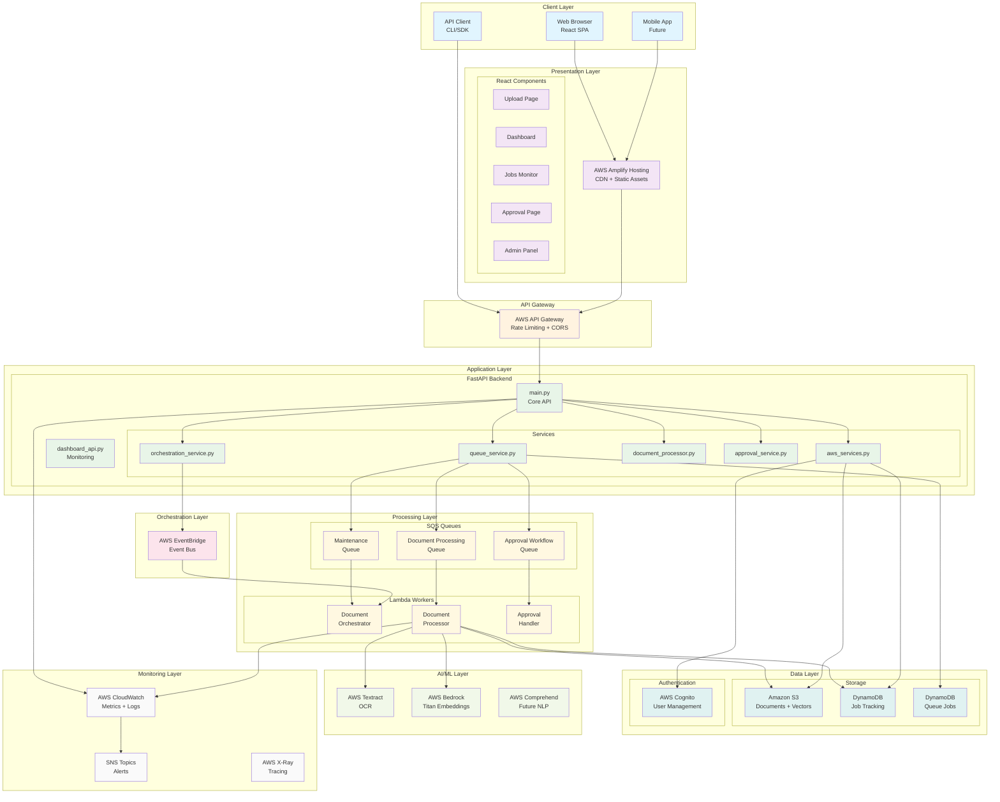
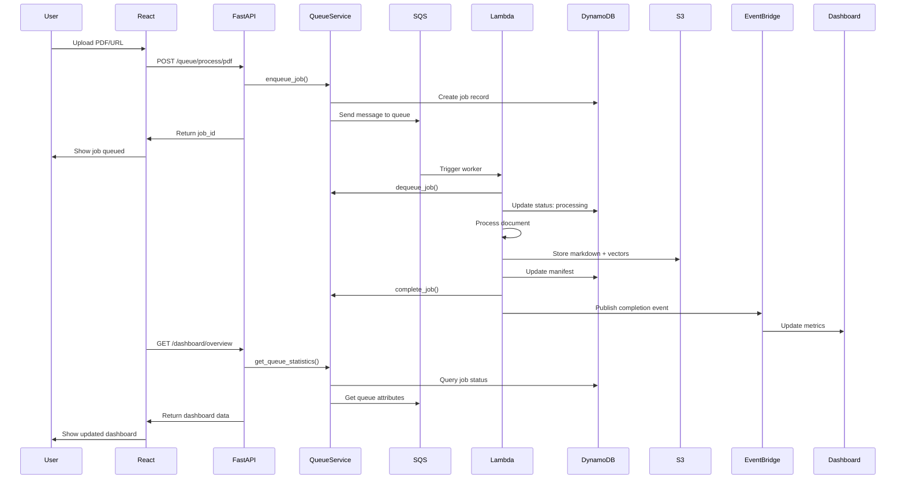
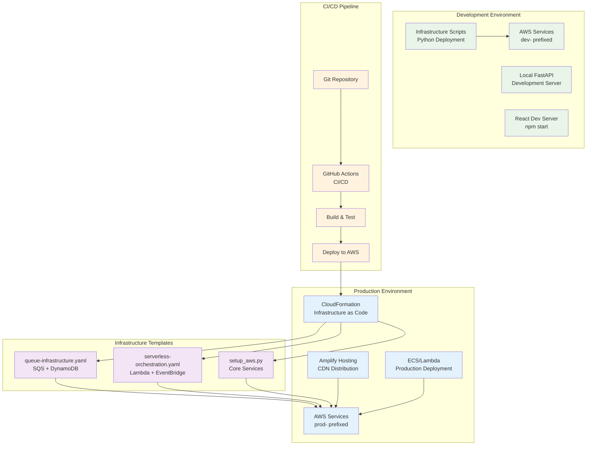
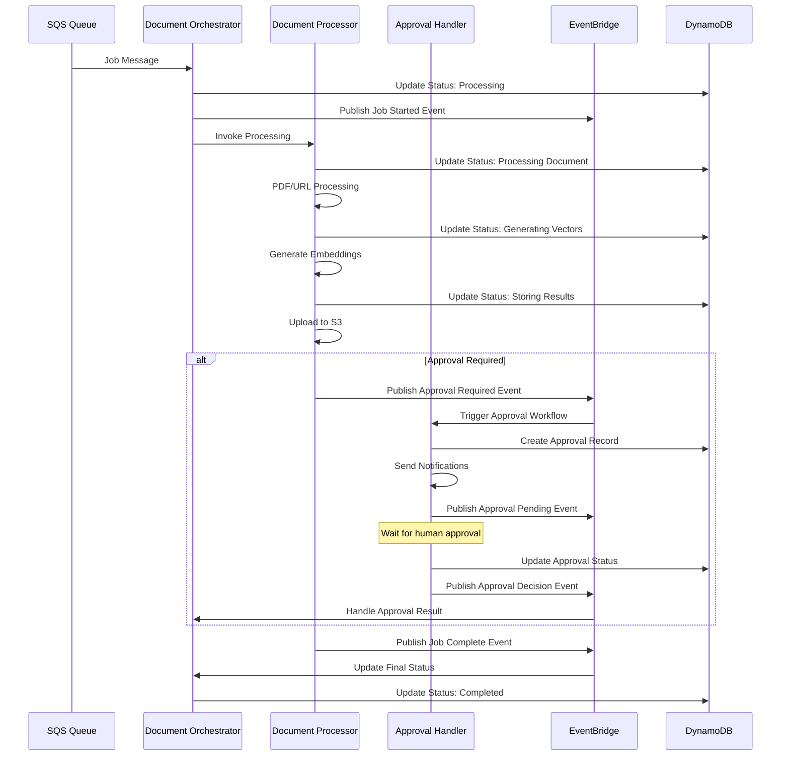

# agent2_ingestor - Architecture

## System Overview - High Level Architecture



## Job Queue System - Detailed View

```mermaid
graph TB
    %% User Input
    subgraph "User Actions"
        PDF_UPLOAD[PDF Upload]
        URL_INPUT[URL Input]
        APPROVAL_REQ[Approval Request]
    end

    %% API Endpoints
    subgraph "FastAPI Endpoints"
        QUEUE_PDF[/queue/process/pdf]
        QUEUE_URL[/queue/process/urls]
        QUEUE_APPROVAL[/queue/approval]
        STATUS[/queue/jobs/status]
    end

    %% Queue Service
    subgraph "Queue Service"
        ENQUEUE[Enqueue Job]
        DEQUEUE[Dequeue Job]
        STATUS_UPDATE[Update Status]
        RETRY_LOGIC[Retry Logic]
    end

    %% SQS Queues with Priorities
    subgraph "SQS Queues"
        subgraph "Document Processing Queue"
            DOC_URGENT[Priority 4: Urgent]
            DOC_HIGH[Priority 3: High]
            DOC_NORMAL[Priority 2: Normal]
            DOC_LOW[Priority 1: Low]
        end
        
        subgraph "Approval Workflow Queue"
            APP_URGENT[Priority 4: Urgent]
            APP_HIGH[Priority 3: High]
            APP_NORMAL[Priority 2: Normal]
            APP_LOW[Priority 1: Low]
        end
        
        subgraph "Dead Letter Queues"
            DOC_DLQ[Document DLQ]
            APP_DLQ[Approval DLQ]
            MAINT_DLQ[Maintenance DLQ]
        end
    end

    %% Lambda Workers
    subgraph "Lambda Workers"
        WORKER1[Document Worker 1]
        WORKER2[Document Worker 2]
        WORKER3[Approval Worker]
        ORCHESTRATOR[Orchestrator]
    end

    %% Job Tracking
    subgraph "Job Tracking"
        JOB_DB[(DynamoDB<br/>Queue Jobs Table)]
        JOB_STATUS[Job Status:<br/>queued → processing<br/>→ completed/failed]
    end

    %% Processing Flow
    PDF_UPLOAD --> QUEUE_PDF
    URL_INPUT --> QUEUE_URL
    APPROVAL_REQ --> QUEUE_APPROVAL
    
    QUEUE_PDF --> ENQUEUE
    QUEUE_URL --> ENQUEUE
    QUEUE_APPROVAL --> ENQUEUE
    
    ENQUEUE --> DOC_URGENT
    ENQUEUE --> DOC_HIGH
    ENQUEUE --> DOC_NORMAL
    ENQUEUE --> DOC_LOW
    ENQUEUE --> APP_URGENT
    ENQUEUE --> APP_HIGH
    ENQUEUE --> APP_NORMAL
    ENQUEUE --> APP_LOW
    
    DOC_URGENT --> WORKER1
    DOC_HIGH --> WORKER1
    DOC_NORMAL --> WORKER2
    DOC_LOW --> WORKER2
    
    APP_URGENT --> WORKER3
    APP_HIGH --> WORKER3
    APP_NORMAL --> WORKER3
    APP_LOW --> WORKER3
    
    WORKER1 --> JOB_DB
    WORKER2 --> JOB_DB
    WORKER3 --> JOB_DB
    
    WORKER1 --> STATUS_UPDATE
    WORKER2 --> STATUS_UPDATE
    WORKER3 --> STATUS_UPDATE
    
    RETRY_LOGIC --> DOC_DLQ
    RETRY_LOGIC --> APP_DLQ
    
    STATUS --> JOB_STATUS
    JOB_DB --> JOB_STATUS

    %% Styling
    classDef userAction fill:#e3f2fd
    classDef api fill:#fff3e0
    classDef service fill:#e8f5e8
    classDef queue fill:#fff8e1
    classDef worker fill:#f3e5f5
    classDef database fill:#e0f2f1
    classDef dlq fill:#ffebee
    
    class PDF_UPLOAD,URL_INPUT,APPROVAL_REQ userAction
    class QUEUE_PDF,QUEUE_URL,QUEUE_APPROVAL,STATUS api
    class ENQUEUE,DEQUEUE,STATUS_UPDATE,RETRY_LOGIC service
    class DOC_URGENT,DOC_HIGH,DOC_NORMAL,DOC_LOW,APP_URGENT,APP_HIGH,APP_NORMAL,APP_LOW queue
    class WORKER1,WORKER2,WORKER3,ORCHESTRATOR worker
    class JOB_DB,JOB_STATUS database
    class DOC_DLQ,APP_DLQ,MAINT_DLQ dlq
```

## Document Processing Pipeline

```mermaid
graph LR
    %% Input Sources
    subgraph "Input Sources"
        PDF[PDF File]
        URL[Web URL]
    end

    %% Processing Steps
    subgraph "Document Processing Pipeline"
        VALIDATE[Validate Input]
        EXTRACT[Content Extraction]
        CLEAN[Text Cleaning]
        CONVERT[Markdown Conversion]
        VECTORIZE[Generate Embeddings]
        STORE[Store in S3]
        MANIFEST[Update Manifest]
    end

    %% OCR Processing
    subgraph "OCR Processing"
        TEXTRACT[AWS Textract<br/>Extract Text]
        LAYOUT[Layout Analysis]
        TABLES[Table Detection]
    end

    %% URL Processing
    subgraph "URL Processing"
        FETCH[Fetch Content]
        PARSE[Parse HTML]
        SCRAPE[Extract Text]
    end

    %% AI Processing
    subgraph "AI/ML Processing"
        BEDROCK[Bedrock Titan<br/>Embeddings]
        CHUNKS[Text Chunking]
        VECTORS[Vector Generation]
    end

    %% Storage
    subgraph "Storage Layer"
        S3_DOCS[S3: Documents]
        S3_VECTORS[S3: Vector Sidecars]
        MANIFEST_JSON[S3: manifest.json]
        DYNAMODB[DynamoDB: Jobs]
    end

    %% Processing Flow
    PDF --> VALIDATE
    URL --> VALIDATE
    
    VALIDATE --> EXTRACT
    
    EXTRACT --> TEXTRACT
    EXTRACT --> FETCH
    
    TEXTRACT --> LAYOUT
    LAYOUT --> TABLES
    TABLES --> CLEAN
    
    FETCH --> PARSE
    PARSE --> SCRAPE
    SCRAPE --> CLEAN
    
    CLEAN --> CONVERT
    CONVERT --> VECTORIZE
    
    VECTORIZE --> BEDROCK
    BEDROCK --> CHUNKS
    CHUNKS --> VECTORS
    
    VECTORS --> STORE
    CONVERT --> STORE
    
    STORE --> S3_DOCS
    STORE --> S3_VECTORS
    STORE --> MANIFEST
    
    MANIFEST --> MANIFEST_JSON
    STORE --> DYNAMODB

    %% Styling
    classDef input fill:#e3f2fd
    classDef processing fill:#e8f5e8
    classDef ocr fill:#fff3e0
    classDef url fill:#f3e5f5
    classDef ai fill:#f1f8e9
    classDef storage fill:#e0f2f1
    
    class PDF,URL input
    class VALIDATE,EXTRACT,CLEAN,CONVERT,VECTORIZE,STORE,MANIFEST processing
    class TEXTRACT,LAYOUT,TABLES ocr
    class FETCH,PARSE,SCRAPE url
    class BEDROCK,CHUNKS,VECTORS ai
    class S3_DOCS,S3_VECTORS,MANIFEST_JSON,DYNAMODB storage
```



## Real-Time Monitoring Dashboard

```mermaid
graph TB
    %% Dashboard Components
    subgraph "Dashboard Frontend"
        HEALTH_WIDGET[System Health<br/>Score & Status]
        QUEUE_WIDGET[Queue Statistics<br/>Pending/Processing]
        WORKER_WIDGET[Active Workers<br/>Performance Metrics]
        METRICS_WIDGET[Performance Metrics<br/>Throughput/Latency]
        ALERTS_WIDGET[System Alerts<br/>Issues & Warnings]
    end

    %% Dashboard API
    subgraph "Dashboard API Endpoints"
        HEALTH_API[/dashboard/health]
        OVERVIEW_API[/dashboard/overview]
        QUEUES_API[/dashboard/queues]
        WORKERS_API[/dashboard/workers]
        METRICS_API[/dashboard/metrics]
        ALERTS_API[/dashboard/alerts]
    end

    %% Data Sources
    subgraph "Data Collection"
        QUEUE_STATS[Queue Service<br/>Statistics]
        JOB_TRACKING[DynamoDB<br/>Job Tracking]
        CLOUDWATCH_METRICS[CloudWatch<br/>Metrics]
        SQS_ATTRS[SQS Queue<br/>Attributes]
        WORKER_STATUS[Lambda<br/>Worker Status]
    end

    %% Real-time Updates
    subgraph "Real-time Updates"
        POLLING[Frontend Polling<br/>Every 10-30s]
        WEBSOCKET[WebSocket<br/>Future Enhancement]
        AUTO_REFRESH[Auto Refresh<br/>Dashboard]
    end

    %% Alerting
    subgraph "Alerting System"
        DLQ_ALERTS[DLQ Message<br/>Alerts]
        BACKLOG_ALERTS[Queue Backlog<br/>Alerts]
        HEALTH_ALERTS[System Health<br/>Alerts]
        SNS_TOPICS[SNS Topics<br/>Notifications]
    end

    %% Dashboard Flow
    HEALTH_WIDGET --> HEALTH_API
    QUEUE_WIDGET --> QUEUES_API
    WORKER_WIDGET --> WORKERS_API
    METRICS_WIDGET --> METRICS_API
    ALERTS_WIDGET --> ALERTS_API
    
    HEALTH_API --> QUEUE_STATS
    OVERVIEW_API --> JOB_TRACKING
    QUEUES_API --> SQS_ATTRS
    WORKERS_API --> WORKER_STATUS
    METRICS_API --> CLOUDWATCH_METRICS
    
    POLLING --> AUTO_REFRESH
    AUTO_REFRESH --> HEALTH_WIDGET
    AUTO_REFRESH --> QUEUE_WIDGET
    AUTO_REFRESH --> WORKER_WIDGET
    
    QUEUE_STATS --> DLQ_ALERTS
    SQS_ATTRS --> BACKLOG_ALERTS
    CLOUDWATCH_METRICS --> HEALTH_ALERTS
    
    DLQ_ALERTS --> SNS_TOPICS
    BACKLOG_ALERTS --> SNS_TOPICS
    HEALTH_ALERTS --> SNS_TOPICS

    %% Styling
    classDef dashboard fill:#e3f2fd
    classDef api fill:#fff3e0
    classDef data fill:#e0f2f1
    classDef realtime fill:#f3e5f5
    classDef alerts fill:#ffebee
    
    class HEALTH_WIDGET,QUEUE_WIDGET,WORKER_WIDGET,METRICS_WIDGET,ALERTS_WIDGET dashboard
    class HEALTH_API,OVERVIEW_API,QUEUES_API,WORKERS_API,METRICS_API,ALERTS_API api
    class QUEUE_STATS,JOB_TRACKING,CLOUDWATCH_METRICS,SQS_ATTRS,WORKER_STATUS data
    class POLLING,WEBSOCKET,AUTO_REFRESH realtime
    class DLQ_ALERTS,BACKLOG_ALERTS,HEALTH_ALERTS,SNS_TOPICS alerts
```

## Data Flow Sequence



## Deployment Architecture



## Usage Instructions

To use these Mermaid diagrams:

1. **Copy any diagram** from the code blocks above
2. **Paste into any Mermaid-compatible tool**:
   - GitHub README (renders automatically)
   - Mermaid Live Editor (https://mermaid.live)
   - VS Code with Mermaid extensions
   - Confluence, Notion, or other documentation tools
   - Draw.io (supports Mermaid import)

3. **Customize as needed**:
   - Modify colors by changing `classDef` definitions
   - Add/remove components based on your specific deployment
   - Adjust styling and layout preferences

Each diagram focuses on a specific aspect of the architecture:
- **System Overview**: Complete high-level architecture
- **Job Queue System**: Detailed queue processing flow
- **Document Processing**: Step-by-step processing pipeline
- **Monitoring Dashboard**: Real-time monitoring components
- **Data Flow Sequence**: Time-based interaction flow
- **Deployment Architecture**: Environment and CI/CD setup

These diagrams provide comprehensive visual documentation of the emergency document processor system we've built! 🎯

## Lambda Workers - Detailed Functionality

### Document Orchestrator Lambda - Event Coordination

```mermaid
graph TB
    %% Input Events
    subgraph "Event Sources"
        SQS_EVENT[SQS Queue Event]
        EVENTBRIDGE_EVENT[EventBridge Event]
        API_GATEWAY[API Gateway Event]
        SCHEDULE[CloudWatch Schedule]
    end

    %% Event Processing
    subgraph "Document Orchestrator Lambda"
        HANDLER[lambda_handler()]
        
        subgraph "Event Router"
            EVENT_TYPE[Determine Event Type]
            SQS_HANDLER[handle_sqs_event()]
            EB_HANDLER[handle_eventbridge_event()]
            API_HANDLER[handle_api_event()]
            SCHEDULE_HANDLER[handle_schedule_event()]
        end
        
        subgraph "Job Management"
            JOB_DISPATCH[Job Dispatcher]
            STATUS_TRACKER[Status Tracker]
            ERROR_HANDLER[Error Handler]
            RETRY_MANAGER[Retry Manager]
        end
        
        subgraph "Event Publishing"
            PUBLISH_START[Publish Job Started]
            PUBLISH_PROGRESS[Publish Progress Update]
            PUBLISH_COMPLETE[Publish Job Complete]
            PUBLISH_ERROR[Publish Error Event]
        end
        
        subgraph "Monitoring"
            METRICS[CloudWatch Metrics]
            LOGGING[Structured Logging]
            TRACING[X-Ray Tracing]
        end
    end

    %% Output Actions
    subgraph "Orchestration Actions"
        INVOKE_PROCESSOR[Invoke Document Processor]
        UPDATE_DYNAMODB[Update Job Status]
        SEND_NOTIFICATION[Send Notifications]
        TRIGGER_APPROVAL[Trigger Approval Flow]
    end

    %% Flow
    SQS_EVENT --> HANDLER
    EVENTBRIDGE_EVENT --> HANDLER
    API_GATEWAY --> HANDLER
    SCHEDULE --> HANDLER
    
    HANDLER --> EVENT_TYPE
    
    EVENT_TYPE --> SQS_HANDLER
    EVENT_TYPE --> EB_HANDLER
    EVENT_TYPE --> API_HANDLER
    EVENT_TYPE --> SCHEDULE_HANDLER
    
    SQS_HANDLER --> JOB_DISPATCH
    EB_HANDLER --> STATUS_TRACKER
    API_HANDLER --> ERROR_HANDLER
    SCHEDULE_HANDLER --> RETRY_MANAGER
    
    JOB_DISPATCH --> PUBLISH_START
    STATUS_TRACKER --> PUBLISH_PROGRESS
    ERROR_HANDLER --> PUBLISH_ERROR
    RETRY_MANAGER --> PUBLISH_COMPLETE
    
    JOB_DISPATCH --> INVOKE_PROCESSOR
    STATUS_TRACKER --> UPDATE_DYNAMODB
    ERROR_HANDLER --> SEND_NOTIFICATION
    RETRY_MANAGER --> TRIGGER_APPROVAL
    
    HANDLER --> METRICS
    HANDLER --> LOGGING
    HANDLER --> TRACING

    %% Styling
    classDef eventSource fill:#e3f2fd
    classDef lambda fill:#fff3e0
    classDef eventRouter fill:#e8f5e8
    classDef jobMgmt fill:#f3e5f5
    classDef eventPub fill:#fff8e1
    classDef monitoring fill:#e0f2f1
    classDef action fill:#fce4ec
    
    class SQS_EVENT,EVENTBRIDGE_EVENT,API_GATEWAY,SCHEDULE eventSource
    class HANDLER lambda
    class EVENT_TYPE,SQS_HANDLER,EB_HANDLER,API_HANDLER,SCHEDULE_HANDLER eventRouter
    class JOB_DISPATCH,STATUS_TRACKER,ERROR_HANDLER,RETRY_MANAGER jobMgmt
    class PUBLISH_START,PUBLISH_PROGRESS,PUBLISH_COMPLETE,PUBLISH_ERROR eventPub
    class METRICS,LOGGING,TRACING monitoring
    class INVOKE_PROCESSOR,UPDATE_DYNAMODB,SEND_NOTIFICATION,TRIGGER_APPROVAL action
```

### Document Processor Lambda - Content Processing

```mermaid
graph TB
    %% Input Processing
    subgraph "Input Handler"
        LAMBDA_EVENT[Lambda Event]
        PARSE_EVENT[Parse SQS Message]
        VALIDATE_PAYLOAD[Validate Job Payload]
        EXTRACT_JOB[Extract Job Details]
    end

    %% Document Processing Core
    subgraph "Document Processor Lambda"
        MAIN_HANDLER[lambda_handler()]
        
        subgraph "Job Processing"
            JOB_START[Start Job Processing]
            CONTENT_ROUTER[Content Type Router]
            PDF_PROCESSOR[PDF Processing Path]
            URL_PROCESSOR[URL Processing Path]
        end
        
        subgraph "PDF Processing Pipeline"
            PDF_VALIDATE[Validate PDF File]
            PDF_EXTRACT[Extract PDF Content]
            OCR_TEXTRACT[AWS Textract OCR]
            PDF_PARSE[Parse OCR Results]
            PDF_CLEAN[Clean Extracted Text]
        end
        
        subgraph "URL Processing Pipeline"
            URL_VALIDATE[Validate URL]
            FETCH_CONTENT[Fetch Web Content]
            PARSE_HTML[Parse HTML Content]
            EXTRACT_TEXT[Extract Text Content]
            URL_CLEAN[Clean Extracted Text]
        end
        
        subgraph "Content Processing"
            TEXT_NORMALIZE[Normalize Text]
            MARKDOWN_CONVERT[Convert to Markdown]
            CHUNK_TEXT[Chunk Text for Vectors]
            GENERATE_METADATA[Generate Metadata]
        end
        
        subgraph "Vector Processing"
            BEDROCK_CLIENT[Bedrock Titan Client]
            EMBED_CHUNKS[Generate Embeddings]
            CREATE_VECTORS[Create Vector Arrays]
            VECTOR_METADATA[Vector Metadata]
        end
        
        subgraph "Storage Operations"
            S3_UPLOAD[Upload to S3]
            STORE_MARKDOWN[Store Markdown File]
            STORE_VECTORS[Store Vector Sidecar]
            UPDATE_MANIFEST[Update Manifest]
        end
        
        subgraph "Job Completion"
            UPDATE_STATUS[Update Job Status]
            PUBLISH_EVENT[Publish Completion Event]
            CLEANUP[Cleanup Resources]
            ERROR_HANDLING[Handle Errors]
        end
    end

    %% External Services
    subgraph "External Dependencies"
        TEXTRACT_SVC[AWS Textract]
        BEDROCK_SVC[AWS Bedrock Titan]
        S3_SVC[Amazon S3]
        DYNAMODB_SVC[DynamoDB]
        EVENTBRIDGE_SVC[EventBridge]
    end

    %% Processing Flow
    LAMBDA_EVENT --> MAIN_HANDLER
    MAIN_HANDLER --> PARSE_EVENT
    PARSE_EVENT --> VALIDATE_PAYLOAD
    VALIDATE_PAYLOAD --> EXTRACT_JOB
    
    EXTRACT_JOB --> JOB_START
    JOB_START --> CONTENT_ROUTER
    
    CONTENT_ROUTER --> PDF_PROCESSOR
    CONTENT_ROUTER --> URL_PROCESSOR
    
    PDF_PROCESSOR --> PDF_VALIDATE
    PDF_VALIDATE --> PDF_EXTRACT
    PDF_EXTRACT --> OCR_TEXTRACT
    OCR_TEXTRACT --> PDF_PARSE
    PDF_PARSE --> PDF_CLEAN
    
    URL_PROCESSOR --> URL_VALIDATE
    URL_VALIDATE --> FETCH_CONTENT
    FETCH_CONTENT --> PARSE_HTML
    PARSE_HTML --> EXTRACT_TEXT
    EXTRACT_TEXT --> URL_CLEAN
    
    PDF_CLEAN --> TEXT_NORMALIZE
    URL_CLEAN --> TEXT_NORMALIZE
    
    TEXT_NORMALIZE --> MARKDOWN_CONVERT
    MARKDOWN_CONVERT --> CHUNK_TEXT
    CHUNK_TEXT --> GENERATE_METADATA
    
    CHUNK_TEXT --> BEDROCK_CLIENT
    BEDROCK_CLIENT --> EMBED_CHUNKS
    EMBED_CHUNKS --> CREATE_VECTORS
    CREATE_VECTORS --> VECTOR_METADATA
    
    MARKDOWN_CONVERT --> S3_UPLOAD
    VECTOR_METADATA --> S3_UPLOAD
    
    S3_UPLOAD --> STORE_MARKDOWN
    S3_UPLOAD --> STORE_VECTORS
    STORE_VECTORS --> UPDATE_MANIFEST
    
    UPDATE_MANIFEST --> UPDATE_STATUS
    UPDATE_STATUS --> PUBLISH_EVENT
    PUBLISH_EVENT --> CLEANUP
    
    %% External Connections
    OCR_TEXTRACT --> TEXTRACT_SVC
    BEDROCK_CLIENT --> BEDROCK_SVC
    S3_UPLOAD --> S3_SVC
    UPDATE_STATUS --> DYNAMODB_SVC
    PUBLISH_EVENT --> EVENTBRIDGE_SVC

    %% Error Handling
    PDF_VALIDATE --> ERROR_HANDLING
    URL_VALIDATE --> ERROR_HANDLING
    OCR_TEXTRACT --> ERROR_HANDLING
    BEDROCK_CLIENT --> ERROR_HANDLING
    S3_UPLOAD --> ERROR_HANDLING

    %% Styling
    classDef input fill:#e3f2fd
    classDef lambda fill:#fff3e0
    classDef jobProc fill:#e8f5e8
    classDef pdfPipe fill:#f3e5f5
    classDef urlPipe fill:#fff8e1
    classDef contentProc fill:#e0f2f1
    classDef vectorProc fill:#f1f8e9
    classDef storage fill:#fce4ec
    classDef completion fill:#e8eaf6
    classDef external fill:#fafafa
    
    class LAMBDA_EVENT,PARSE_EVENT,VALIDATE_PAYLOAD,EXTRACT_JOB input
    class MAIN_HANDLER lambda
    class JOB_START,CONTENT_ROUTER,PDF_PROCESSOR,URL_PROCESSOR jobProc
    class PDF_VALIDATE,PDF_EXTRACT,OCR_TEXTRACT,PDF_PARSE,PDF_CLEAN pdfPipe
    class URL_VALIDATE,FETCH_CONTENT,PARSE_HTML,EXTRACT_TEXT,URL_CLEAN urlPipe
    class TEXT_NORMALIZE,MARKDOWN_CONVERT,CHUNK_TEXT,GENERATE_METADATA contentProc
    class BEDROCK_CLIENT,EMBED_CHUNKS,CREATE_VECTORS,VECTOR_METADATA vectorProc
    class S3_UPLOAD,STORE_MARKDOWN,STORE_VECTORS,UPDATE_MANIFEST storage
    class UPDATE_STATUS,PUBLISH_EVENT,CLEANUP,ERROR_HANDLING completion
    class TEXTRACT_SVC,BEDROCK_SVC,S3_SVC,DYNAMODB_SVC,EVENTBRIDGE_SVC external
```

### Approval Handler Lambda - Workflow Management

```mermaid
graph TB
    %% Input Processing
    subgraph "Approval Input"
        APPROVAL_EVENT[Approval Queue Event]
        PARSE_APPROVAL[Parse Approval Request]
        VALIDATE_REQUEST[Validate Request]
        EXTRACT_DETAILS[Extract Approval Details]
    end

    %% Approval Processing Core
    subgraph "Approval Handler Lambda"
        APPROVAL_HANDLER[lambda_handler()]
        
        subgraph "Request Processing"
            REQUEST_ROUTER[Request Type Router]
            NEW_APPROVAL[New Approval Request]
            APPROVAL_RESPONSE[Approval Response]
            STATUS_CHECK[Status Check]
        end
        
        subgraph "Approval Workflow"
            VALIDATE_USER[Validate User Permissions]
            CHECK_APPROVERS[Check Available Approvers]
            ASSIGN_APPROVER[Assign to Approver]
            SEND_NOTIFICATION[Send Approval Notification]
        end
        
        subgraph "Decision Processing"
            PROCESS_DECISION[Process Approval Decision]
            VALIDATE_APPROVER[Validate Approver Authority]
            UPDATE_STATUS[Update Approval Status]
            HANDLE_APPROVAL[Handle Approved Request]
            HANDLE_REJECTION[Handle Rejected Request]
        end
        
        subgraph "Document Operations"
            RETRIEVE_JOB[Retrieve Original Job]
            VALIDATE_DOCUMENT[Validate Document State]
            TRIGGER_PROCESSING[Trigger Document Processing]
            UPDATE_JOB_STATUS[Update Job Status]
        end
        
        subgraph "Notification System"
            NOTIFY_REQUESTER[Notify Requester]
            NOTIFY_APPROVER[Notify Approver]
            NOTIFY_ADMIN[Notify Administrators]
            LOG_ACTIVITY[Log Activity]
        end
        
        subgraph "Escalation Handling"
            CHECK_TIMEOUT[Check Approval Timeout]
            ESCALATE_REQUEST[Escalate to Senior Approver]
            AUTO_APPROVE[Auto-approve (if configured)]
            SCHEDULE_REMINDER[Schedule Reminder]
        end
    end

    %% External Systems
    subgraph "External Services"
        COGNITO_SVC[AWS Cognito Users]
        SES_SVC[AWS SES Email]
        SNS_SVC[AWS SNS Notifications]
        DYNAMODB_APPROVAL[DynamoDB Approvals]
        DYNAMODB_JOBS[DynamoDB Jobs]
        EVENTBRIDGE_APPROVAL[EventBridge Events]
    end

    %% Processing Flow
    APPROVAL_EVENT --> APPROVAL_HANDLER
    APPROVAL_HANDLER --> PARSE_APPROVAL
    PARSE_APPROVAL --> VALIDATE_REQUEST
    VALIDATE_REQUEST --> EXTRACT_DETAILS
    
    EXTRACT_DETAILS --> REQUEST_ROUTER
    
    REQUEST_ROUTER --> NEW_APPROVAL
    REQUEST_ROUTER --> APPROVAL_RESPONSE
    REQUEST_ROUTER --> STATUS_CHECK
    
    NEW_APPROVAL --> VALIDATE_USER
    VALIDATE_USER --> CHECK_APPROVERS
    CHECK_APPROVERS --> ASSIGN_APPROVER
    ASSIGN_APPROVER --> SEND_NOTIFICATION
    
    APPROVAL_RESPONSE --> PROCESS_DECISION
    PROCESS_DECISION --> VALIDATE_APPROVER
    VALIDATE_APPROVER --> UPDATE_STATUS
    
    UPDATE_STATUS --> HANDLE_APPROVAL
    UPDATE_STATUS --> HANDLE_REJECTION
    
    HANDLE_APPROVAL --> RETRIEVE_JOB
    RETRIEVE_JOB --> VALIDATE_DOCUMENT
    VALIDATE_DOCUMENT --> TRIGGER_PROCESSING
    TRIGGER_PROCESSING --> UPDATE_JOB_STATUS
    
    HANDLE_REJECTION --> NOTIFY_REQUESTER
    HANDLE_APPROVAL --> NOTIFY_REQUESTER
    
    SEND_NOTIFICATION --> NOTIFY_APPROVER
    UPDATE_STATUS --> LOG_ACTIVITY
    
    STATUS_CHECK --> CHECK_TIMEOUT
    CHECK_TIMEOUT --> ESCALATE_REQUEST
    CHECK_TIMEOUT --> AUTO_APPROVE
    CHECK_TIMEOUT --> SCHEDULE_REMINDER
    
    %% External Connections
    VALIDATE_USER --> COGNITO_SVC
    NOTIFY_REQUESTER --> SES_SVC
    NOTIFY_APPROVER --> SNS_SVC
    LOG_ACTIVITY --> DYNAMODB_APPROVAL
    UPDATE_JOB_STATUS --> DYNAMODB_JOBS
    TRIGGER_PROCESSING --> EVENTBRIDGE_APPROVAL

    %% Styling
    classDef input fill:#e3f2fd
    classDef lambda fill:#fff3e0
    classDef requestProc fill:#e8f5e8
    classDef workflow fill:#f3e5f5
    classDef decision fill:#fff8e1
    classDef docOps fill:#e0f2f1
    classDef notification fill:#f1f8e9
    classDef escalation fill:#fce4ec
    classDef external fill:#fafafa
    
    class APPROVAL_EVENT,PARSE_APPROVAL,VALIDATE_REQUEST,EXTRACT_DETAILS input
    class APPROVAL_HANDLER lambda
    class REQUEST_ROUTER,NEW_APPROVAL,APPROVAL_RESPONSE,STATUS_CHECK requestProc
    class VALIDATE_USER,CHECK_APPROVERS,ASSIGN_APPROVER,SEND_NOTIFICATION workflow
    class PROCESS_DECISION,VALIDATE_APPROVER,UPDATE_STATUS,HANDLE_APPROVAL,HANDLE_REJECTION decision
    class RETRIEVE_JOB,VALIDATE_DOCUMENT,TRIGGER_PROCESSING,UPDATE_JOB_STATUS docOps
    class NOTIFY_REQUESTER,NOTIFY_APPROVER,NOTIFY_ADMIN,LOG_ACTIVITY notification
    class CHECK_TIMEOUT,ESCALATE_REQUEST,AUTO_APPROVE,SCHEDULE_REMINDER escalation
    class COGNITO_SVC,SES_SVC,SNS_SVC,DYNAMODB_APPROVAL,DYNAMODB_JOBS,EVENTBRIDGE_APPROVAL external
```

## Lambda Worker Implementation Details

### Document Orchestrator Lambda Functions

```python
# Key functions implemented in document_orchestrator.py

def lambda_handler(event, context):
    """Main entry point for orchestration events"""
    
def handle_sqs_event(records):
    """Process SQS queue messages for job coordination"""
    
def handle_eventbridge_event(detail):
    """Process EventBridge events for system coordination"""
    
def dispatch_job(job_data):
    """Dispatch job to appropriate processor based on type"""
    
def update_job_status(job_id, status, metadata):
    """Update job status in DynamoDB with progress tracking"""
    
def publish_job_event(event_type, job_data):
    """Publish job lifecycle events to EventBridge"""
    
def handle_job_failure(job_id, error_details):
    """Handle job failures with retry logic and error reporting"""
```

### Document Processor Lambda Functions

```python
# Key functions implemented in document_processor.py

def lambda_handler(event, context):
    """Main entry point for document processing"""
    
def process_pdf_document(pdf_data, job_config):
    """Complete PDF processing pipeline with OCR"""
    
def process_url_document(url, job_config):
    """Complete URL processing pipeline with web scraping"""
    
def extract_text_with_textract(pdf_bytes):
    """Extract text from PDF using AWS Textract OCR"""
    
def generate_embeddings(text_chunks):
    """Generate vector embeddings using Bedrock Titan"""
    
def convert_to_markdown(extracted_text, metadata):
    """Convert extracted text to clean markdown format"""
    
def create_vector_sidecar(embeddings, chunks, metadata):
    """Create vector sidecar file for AI/ML integration"""
    
def upload_to_s3(markdown_content, vectors, job_data):
    """Upload processed documents and vectors to S3"""
```

### Approval Handler Lambda Functions

```python
# Key functions implemented in approval_handler.py

def lambda_handler(event, context):
    """Main entry point for approval workflow processing"""
    
def process_approval_request(request_data):
    """Process new approval requests and assign approvers"""
    
def handle_approval_decision(approval_id, decision, approver_id):
    """Process approval/rejection decisions"""
    
def validate_approver_permissions(user_id, approval_type):
    """Validate user has permission to approve specific request types"""
    
def send_approval_notification(approval_data, approver_list):
    """Send approval notifications via email and SNS"""
    
def escalate_approval(approval_id, escalation_level):
    """Escalate approval to higher authority level"""
    
def auto_approve_if_eligible(approval_data):
    """Auto-approve requests that meet specific criteria"""
    
def log_approval_activity(approval_id, activity_type, metadata):
    """Log approval activities for audit trail"""
```

## Inter-Lambda Communication Flow



These detailed diagrams show the comprehensive functionality within each Lambda worker, including error handling, external service integration, and the complete processing pipelines! 🔧